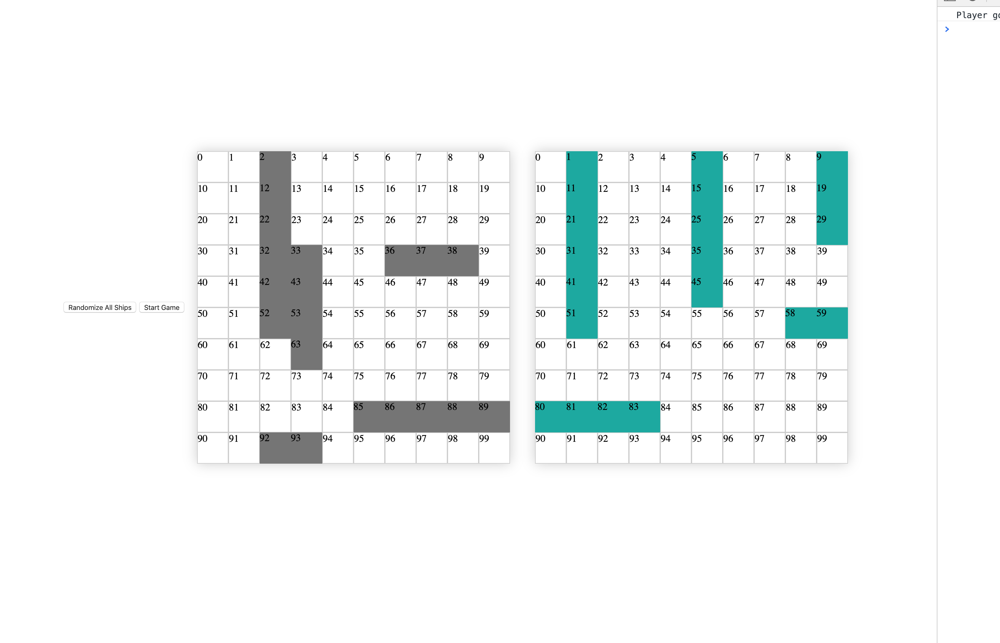

 # Project One - BattleShips!

Table of Contents:
- Project Overview
- The Brief
- Technologies Used
- Approach Taken
- Featured Code
- Screenshots
- Bugs
- Wins and Blockers
- Future Content and Improvements


# Project Overview
Battleships is an strategic type guessing game. Originating as a pencil and paper game dating from around World War I, then released in the 1960's as a board game. Skip to the current day, where the game has spawned a number of electronic versions. 

Commense battle and challenge yourself to sink all your opponents ships before they sink yours. 

This was my first project from General Assembly's Software Engineering Immersive course. It was an individual project built in 9 days, and was the first proper game I had built, and my first real-world type practice with JavaScript. 

Play BattleShips here: https://andy8radshaw.github.io/sei-project-one/


# Game Brief:
- Render a grid based game in the browser
- Create a one-player game against the computer
- The computer must be able to randomly place its peices at the start of the game
- The computer should be able to make random attacks on the players board
- Design logic for winning and losing and display this on the screen
- Include separate HTML, CSS and JavaScript files
- Deploy your game online


 # Technologies used:
- HTML5 with HTML5 audio
- CSS3 with animation
- JavaScript (ES6)
- Git
- GitHub
- Google Fonts


# Approach Taken and Timeline:


Key Dates:
- Day 1 - Planning!
- Day 5-6 - Hit MVP
- Day 6-8 - Try to add extra "nice-to-have" features
- Day 8-9 - Styling

### Day 1: 
I spent the first day of the project planning and trying to break plans down into manageable chunks. I created a list of features that I wanted the game to have, eventually splitting them into MVP and "nice-to-haves". knowing that this game was grid focussed, I spent a fair amount of time thinking and sudo-coding how the ships were going to be positioned onto the grid as I knew this would be one of the biggest challenges of the project. 

### Day 2-4: 
For MVP I decided that both the computer and the player would place their ships at random on the grid. With this firm plan in mind I set about creating a grid and aiming to get one ship positioned on the grid randomly with the click of a button, eventually adding the remaining 4 ships. Each ship's details were stored in an array of objects which included the name, size, grid locations well as isSunk and isVerticle booleans. Using a number of functions to determine wether the ship being created was horizontal or verticle and then populating the squares with the .ship class and adding the location to the ships array.

By the end of Day 3 I had all ships being created at random on the grid however, they were overlapping. This turned out to be a big blocker for me at the time and took a whole day to work out how to get around this. Eventually after reaching out to the community for some advice, I had worked out that the current ship being created needed to be stored in a currentShip array and then checked against the other previously built and stored ship locationsin another reservedSpaces array. If the starting point of the current ship or any of its additional locations within the reservedSpaces array then it would re-start the build process until the point at which none of the ships locations were overlapping with the reservedSpaces. At this point it woud then be transferred from the currentShip array into the 'ships[currentShip].locations array. This Took me until the end of Day 4! This code is highlighted below in the 'Featured Code' section.

### Day 5:
After getting one grid fully working it was a simple task to repeat the logic to build the second grid and get the ships appearing. The next task was to implement the taking shots from both computer and player. A simple click and shoot (event.target) method was used for the player and the computer would create a random number between 0-99 of where to fire. Each comp shot was then checked against the ship locations and either hit or miss class was added to the grid square. 

By the end of day 5 I had hit MVP and had a random choice between computer or Player going first as well as a simple winners screen once all the ship locations were hit.




### Day 6:
The plan for day 6 was to add better intelligence to the computers gameplay so it would act more human-like when it had a 'hit' and continue to target the ship until it was sunk. For this I added a function to check if the ships previous shot was a hit and if so then to take a shot in a location next to the previous 'hit' location. This took up a fair amount of the day and by the evening I had decided to take a break from this feature and add further game features such as message boards, Instructions, and some audio to liven up the playing experience. 


### Day 7-8:
Most of Day 7 was spent bug fixing and removing errors showing up in the console. The main errors were due to higher order functions being looped on the computers turn, however with some careful refactoring most issues were sorted fairly fast. It was then a case of cutting my losses on adding any further complex functionality (such as player controlling the positioning of the ships) and adding more overall styling. I added a range of different audio clips and introduction and outro music to the game as well as a mute audio button. Very late on day 8 I added higher quality ship images which worked no matter the position of the ship - this for sure is some code that could be refactored however, the following day was the deadline and there were other things to focus on to get the app finished. 

### Day 9:
Spent the day cleaning up the look of the app and making sure all implemented functions were working smoothly with no errors. I also added a small amount of media queries so the game would work on lower resolution screens. The app was then deployed through GitHub pages. 


# Featured Code:
### Creating the ships

You can see the function that creates a ship below and the multi stage process that is undertaken when creating 5 ships on the grid at random without overlapping each other and staying within the grid boundaries!

You will also see that I have added a number of comments in the code explaining what each part of the code does. 

``` 
function createShip(numOfSquaresToFill, shipIndex) {

    //* horizontal or vertical?
    function horizontalOrVertical() {
      const num = Math.floor(Math.random() * 2)
      if (num === 0) {
        createVerticalShip()
      } else {
        createHorizontalShip() // currently calling vertical ship again for testing, you need to change this back
      }
    }

    //* creating verticle ship
    function createVerticalShip() {
      //generate starting number
      const startingPoint = Math.floor(Math.random() * (cellsPlayer.length - ((numOfSquaresToFill * width) + 10)))
      // while random number is a reserved number, regenerate
      if (reservedSpaces.includes(startingPoint)) {
        return createShip(numOfSquaresToFill, shipIndex)
      }
      //this variable holds the starting point initially and then the next index is added in the loop below
      const currentShip = [startingPoint]
      // calculate rest of ship and put into current ship array
      for (let i = 1; i < numOfSquaresToFill; i++) {
        const shipBodyPart = startingPoint + (10 * i)
        if (reservedSpaces.includes(shipBodyPart)) {
          // if any part of the body is in reserved space, redo function (without having stored anything!)
          return createShip(numOfSquaresToFill, shipIndex)
        } else {
          currentShip.push(shipBodyPart)
        }
      }
      ship[shipIndex].location = currentShip //add current ship to the ship object
      ship[shipIndex].isVerticle = true
      for (let i = 0; i < ship[shipIndex].location.length; i++) {
        cellsPlayer[ship[shipIndex].location[i]].classList.add('ship')
        //add index to reserved spaces array
        reservedSpaces.push(ship[shipIndex].location[i])
      }
    }

    //* creating horizontal ship
    function createHorizontalShip() {
      // create array of suitable starting numbers to choose from
      const newArray = []
      for (let i = 0; i < cellsPlayer.length; i++) {
        if (i % width < (width - (numOfSquaresToFill - 1))) {
          newArray.push(i)
        }
      }
      // generate starting index and starting number from above array
      const startingPointIndex = Math.floor(Math.random() * newArray.length)
      const startingPoint = newArray[startingPointIndex]
      // while random number is a reserved number, regenerate
      if (reservedSpaces.includes(startingPoint)) {
        return createShip(numOfSquaresToFill, shipIndex)
      }
      // this variable holds the starting point initially and then the next index is added in the loop below
      const currentShip = [startingPoint]
      //calculate the rest of the ship and put into the current array
      for (let i = 1; i < numOfSquaresToFill; i++) {
        const shipBodyPart = startingPoint + (1 * i)
        if (reservedSpaces.includes(shipBodyPart)) {
          // if any part of the body is in reserved space, redo function (without having stored anything!)
          return createShip(numOfSquaresToFill, shipIndex)
        } else {
          currentShip.push(shipBodyPart)
        }
      }
      //add the current ship to the ship object
      ship[shipIndex].location = currentShip
      ship[shipIndex].isVerticle = false
      for (let i = 0; i < ship[shipIndex].size; i++) {
        cellsPlayer[ship[shipIndex].location[i]].classList.add('ship')
        reservedSpaces.push(ship[shipIndex].location[i])
      }
    }
    horizontalOrVertical()
  }

  ```


# Bugs:
- currently the computer has basic intelligence. It will check if its previous shot was a hit and if so, take its next shot around that cell. however, if it then misses it will take its next shot at random. Idealy I would like the computer, once it has made a hit, to have the intelligence to completely sink the ship in all directions before moving on to its next random shot. 
- Throughout the build of the project there were a number of bugs experienced. however, by keeping the mindset to create a simple game and trying not to over-complicate things as well as spending lots of time testing has helped me iron out all smaller bugs and create a simple and fun game


# Wins and Blockers
- The biggest challenge and blocker for me was getting the ships to place randomly on the grid without overlapping each other. Once I understood the idea of creating a potential ship location in an array and then checking this against all current ship locations then I was able to move past this point. But this did take me a long while to work out. 
- A big win for me in this project was my increased level of JS and how to apply code in an ordered manner. Using higher level functionality and 


# Future content and improvements:
- Increased Computer intelligence
- differing levels of difficulty
- the ability for players to move ships and place them where they want as well as the random button currently implemented
- Add a multi-player feature so two players could compete against each other
- explosions and misses to be animated
- the grids to be animated
- animated bombs across the page from one grid to the other
- more concise and DRY code in certain areas

- I have learned from this project that I need to do more refactoring of my code as I am working on the project. I tried to write understandable, clean and well annotated code, however, there are certainly sections in this project where I didn't have time to refactor at all and it was a case of adding the working code and getting the job done and moving on. 
